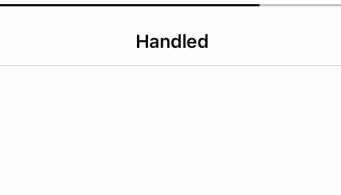

# XYVolumeHandler
🎶 Graceful handle the volume changes in your iOS apps like Instagram.

# Screenshot


# Requirement
iOS 8+, Objective-C And Swift

# Installation
pod 'XYVolumeHandler'

# Usage
In the ViewController you want to be handled,

```swift
// ViewController.m
import XYVolumeHandler
```

```swift
override func viewDidLoad() {
   super.viewDidLoad()
   // Start monitor the volume taps     
   XYVolumeHandler.sharedInstance().startMonitor()
   self.xy_setupVolumeView()
}
```

and conform the protocol,

```swift

extension ViewController: XYVolumeHandlerProtocol {
    func needShowVolumeHandlerNotification() -> Bool {
        return true
    }
}
```

now, you are ready to be handled

# Credits

[JDStatusBarNotification](https://github.com/calimarkus/JDStatusBarNotification)

# Licence
MIT

